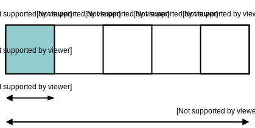

This post is about what arrays are, why they're useful, and how they are implemented in C and Ruby.

_Note: This is the first post in a series on data structures_

## What is an array?

An array is a data structure that holds a collection of elements.

For example, this is an array in the Ruby programming language:

```ruby
arr = ['a','b','c','d','e']
```

Generally, an array is **a contiguous piece of memory**, where each element exists one after the other.

You can imagine an array as a list of boxes containing a value and a number (an index) to identify the box:


You access array elements using their index number. Normally arrays are 0 indexed, meaning the first element is at index `0`:

```ruby
arr[0] # 'a'
```

Arrays provide **random access** to data. Theoretically, it takes the same amount of time to access an element at index `1`, as it does at to access an element at index `1000`. That's O(1) complexity in Big O notation.

Arrays are a fundamental data structure, and almost every language implements them in some form, but what makes them so popular?

## Why do we use arrays?

Arrays have two main strengths:

- Random memory access
- Representing variable data

Random memory access is powerful. Algorithms like [binary search](https://en.wikipedia.org/wiki/Binary_search_algorithm) use random access to improve efficiency of tasks (like searching a sorted list) by several orders of magnitude.

Because of random access, arrays are the building blocks for many other data structures (which I'll cover in future blog posts).

The other benefit of arrays is that they can represent variable data.

For example, you could create an API that returns blog posts as an array in a JSON object:

```json
{
  "posts": [
    {
      "title": "An introduction to arrays",
      "description": "Learn about arrays"
    },
    {
      "title": "An introduction to stacks",
      "description": "Learn about stacks"
    }
  ]
}
```

Then on a server you could fetch the posts, and use a templating language, like Ruby ERB, to generate HTML by looping over the array:

```erb
<% @posts.each do |post| %>
  <h1><%= post["title"] %></h1>
  <p><%= post["description"] %></p>
<% end %>
```

This variable representation of data is incredibly useful for data driven applications. Arrays are heavily used at every level of software abstraction.

Now that you know a bit about why arrays are useful, you might be wondering how they are actually implemented.

## How arrays are implemented

There are two main array implementations: static arrays and dynamic arrays. I'll show you first how static arrays are implemented in C, and then how dynamic arrays are implemented in Ruby.


### Implementing static arrays in C

Static arrays in C are fixed-size arrays that contain _homogenous data_ (each element is of the same data type).

To define an array in C, you provide the data type that the array will hold (for example `int`), as well as the size of the array:

```c
int arr[5];
```

You can access and set array data using the index of the element:

```c
arr[0] = 0;
```

But once you've defined an array, you can't add extra elements to the it, because C arrays are fixed-size.

C is a compiled language. In order to execute a C program, you must first convert it to machine code by running it through a compiler.

A C compiler uses the data type and size of an array to allocate space in memory.

For example, on my Mac an `int` is 4 bytes, So an array that can hold 5 `int` values requires 20 bytes of memory:

_Note: `0xC` is the hexadecimal representation of 12, and `0x10` is the hexadecimal representation of 16_



When C is compiled to machine code, array elements are accessed by their memory address, which is calculated using the element index and data type.

You can see how this works by looking at the assembly code generated from a C program.

Take the following code for an array `arr` with space for 100 `int` elements:

```c
int arr[100];

arr[0] = 1;
arr[1] = 2;
arr[99] = 3;
```

The base memory address of `arr` is represented as `arr(%rip)` in the assembly code. So the following line moves a value of 1 (`$1`) to the array base address:

```
movl	$1, arr(%rip)
```

Which is the equivilant of:

```c
arr[0] = 1;
```

The assembly code accesses elements in an array by adding an offset to the base address. The offset is calculated as: `index` `*` `data type bytes`.

For example, index `1` is `4` bytes from the base address, because the index (`1`) multiplied by the data size (`4`) equals `4`:

```
movl	$2, arr+4(%rip)
```

And index `99` is 396 bytes (`99 * 4`) from the base address:

```
movl	$3, arr+396(%rip)
```

You can see that arrays in C translate very closely to assembly code.

C arrays can be difficult to work with, because once they have been defined you cannot increase the array capacity. In higher-level array implementations, arrays are dynamic and can expand and contract in size over time.

The best way to understand dynamic arrays is by looking at their implementation. Ruby is a good example to study.

### Implementing dynamic arrays in Ruby

Ruby is an interpreted language. Instead of being compiled to machine code, Ruby programs are run by another program known as an interpreter.

There are many different Ruby interpreters, but I'll show you how Ruby implements arrays in the C Ruby interpreter (Ruby MRI).

Unlike C arrays, Ruby arrays are implemented as a class, with methods like `push`, which adds new elements to an array.

Ruby arrays are dynamic. They increase in size to accommodate new elements:

```ruby
arr = [1,2,3]

digits = 0..999

digits.each do |digit|
   arr.push(digit)
end
```

Although the arrays are dynamic, you still get random access:

```ruby
arr = [1,2,3]
arr[0]
```

So how is this dynamic array implemented?

The basic idea is to create a wrapper object, which manages the array data. The wrapper handles access to the array elements, and reallocates memory if the array needs to increase in size.

In Ruby MRI, an array is defined in a C `struct`—`RArray`. `RArray` has a `len` value, containing the current length of the array, a `capa` value, which is the maximum capacity of the array, and a `ptr` which is a pointer (reference) to a contiguous chunk of memory that can store `capa` values.

_Note: `ptr` has a `VALUE` data type, which is a pointer to any Ruby object._

```c
struct RArray {
    struct RBasic basic;
    UINT len, capa;
    VALUE *ptr;
};
```

You can imagine an RArray object like arrays:


Ruby programs get random access to an array, by using the pointer (`ptr`) as the base memory address. You can see this in the Ruby interpreter function that accesses an item at a given offset (`ary_entry`):

```c
ary_entry(ary, offset)
    struct RArray *ary;
    int offset;
{
    // ..

    return ary->ptr[offset];
}
```

You can see how Ruby handles reallocation by looking at the Ruby Array append `<<` method is implemented. `<<` adds a new element to the end of an array:

```ruby
arr = []
arr << 0 #=> [0]
arr << 1 #=> [0,1]
arr << 2 #=> [0,1,2]
```

Internally, Ruby uses an `ary_push` function to implement the array `<<` method.

_Note: The code examples are from Ruby MRI v1_0_

`ary_push` calls a helper function `ary_store` with the array (`ary`) that `push` was called on, the current array length (`len`)—which will be the index of the added element—and the element that should be added (`item`):

```c
ary_push(ary, item)
    struct RArray *ary;
    VALUE item;
{
    ary_store(ary, ary->len, item);
    return (VALUE) ary;
}
```

The reallocation happens in `ary_store`, which attempts to add a new item (`val`) to `ary -> ptr` at the specified index.

`ary_store` first checks that the index for the new array item (`idx`) can fit in the currently assigned memory (using `capa`). If it can't, then `ary_store` allocates more memory using `REALLOC_N`. It does this either by expanding the current memory block pointed to by `ptr`, or by acquiring a new memory block and copying the existing elements over. `ary_store` then updates the `ary.len` value, and finally adds the new item to the array `ptr` at the index (`idx`):

```c
void ary_store(ary, idx, val)
    struct RArray *ary;
    int idx;
    VALUE val;
{
  if (idx >= ary->capa) {
    ary->capa = idx + ARY_DEFAULT_SIZE;
    REALLOC_N(ary->ptr, VALUE, ary->capa);
  }

  // ..

  if (idx >= ary->len) {
    ary->len = idx + 1;
  }
  ary->ptr[idx] = val;
}
```

Because of this, array operations in Ruby can take longer than normal, if the Ruby virtual machine must reallocate memory as a result.

A similar approach for creating dynamic arrays is used in other languages. For example, lists in Python (which also has an interpreter written in C), and vectors in C++.

So now you've seen what arrays are, and how they're implemented. The next part of the story is where arrays are used.

## Conclusion

Arrays are a fundamental data structure. They can be either dynamic or static. Although static arrays are easier to understand, dynamic arrays are easier to use from a programmers perspective

Future posts in this series will explore how arrays are used to implement more complicated data structures.

I hope you enjoyed this post. If you have any questions, please leave a comment.
