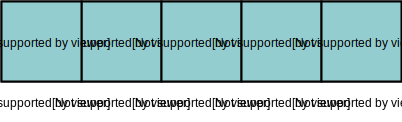
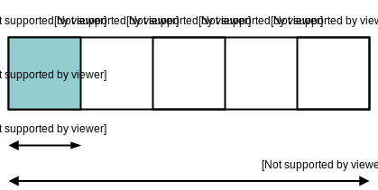
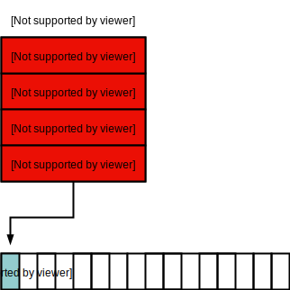

<style>
  .post table {
    max-width: 280px;
  }
</style>

In this post you'll learn what arrays are, why they are useful, and how they are implemented in C and Ruby.

_This is the first post in a series on data structures. The series focusses on how data structures are used and implemented in popular open source projects._

## What is an array?

An array is a data structure that holds a collection of elements.

For example, this is an array in the Ruby programming language:

```ruby
arr = ['a','b','c','d','e']
```

Generally, an array is **a contiguous piece of memory**, where each element exists one after the other.

You can imagine an array as a list of boxes containing a value and a number (an _index_) to identify the box.



Array elements are accessed by their index number. Normally arrays are 0 indexed, meaning the first element is at index `0`:

```ruby
arr[0] #=> "a"
arr[1] #=> "b"
```

Arrays provide **random access** to data. Theoretically, it takes the same amount of time to access an element at index `1` as it does at to access an element at index `1000` ( that's O(1) in [Big O notation](https://rob-bell.net/2009/06/a-beginners-guide-to-big-o-notation/)). This is the main reason to use arrays.

There are two common array implementations in programming languages: static arrays, and dynamic arrays. Static arrays cannot grow in size once they have been defined, whereas dynamic arrays can.

_Note: static arrays shouldn't be confused with arrays in C defined with the `static` keyword. In this post, I use static to mean an array that can't increase in size once defined._

C arrays are static. To define an array in C, you provide the data type that the array will hold (for example `int`) and the size of the array:

```c
int arr[5];
```

Once defined, you can access and set array data using its index:

```c
arr[0] = 0;
```

But you can't increase the number of elements that the array can hold.

In contrast, dynamic arrays grow to accommodate extra elements. Dynamic arrays are often implemented as a class with methods, like `push`, to operate on the array:

```ruby
arr = ['a','b']

arr.push('c') #=> ["a", "b", "c"]
```

Arrays are a fundamental data structure, and almost every language implements them, but why should you use them?

## Why use arrays?

Random memory access is by far the most compelling reason to use an array. Algorithms like [binary search](https://en.wikipedia.org/wiki/Binary_search_algorithm) use random access to improve the efficiency of tasks (like searching a sorted list) by orders of magnitude.

Because of the power of random access, arrays are the building blocks for many other data structures, which I'll cover in future posts.

Aside from accessing data though, array operations can be costly. Take a look at the table for array operations in Big O notation:

| Operation | Worst case |
| --------- | ---------- |
| Access    | O(1)       |
| Search    | O(n)       |
| Insertion | O(n)       |
| Deletion  | O(n)       |

Now that you know what arrays are, and why they're useful, I want to show you how they are implemented.

## How are arrays implemented?

In this section I'll show you how arrays are implemented. First, how static arrays are implemented in C, and then how dynamic arrays are implemented in Ruby.

### Implementing static arrays in C

Arrays in C are static and contain _homogenous data_, where each element is of the same data type:

```c
int arr[5];

arr[0] = 1;
```

C is a compiled language. In order to execute a C program, you must first convert it to machine code by running it through a compiler.

You can understand how arrays are implemented by looking at the assembly code generated by a C compiler, which I'll show you in this section.

_Note: assembly code is human-readable source code that's very close to actual machine code._

A C compiler uses the data type and size of an array to allocate space in memory. For example, on my Mac an `int` is 4 bytes, So an array that can hold 5 `int` values requires 20 bytes of memory.



When C is compiled to machine code, array elements are accessed by their memory address, which is calculated using the element index and data type.

You can see how this works by looking at the assembly code generated from a C program. Take the following code that declares an array `arr` with space for 100 `int` elements:

_Note: `extern` is used to make the assembly easier to understand. `extern` tells the compiler that the memory for `arr` is allocated elsewhere._

```c
extern int arr[100];

arr[0] = 1;
arr[1] = 2;
arr[99] = 3;
```

The base memory address of `arr` is represented as `arr(%rip)` in the assembly code. So the following line moves a value of 1 (`$1`) to the array base memory address:

```
movl	$1, _arr(%rip)
```

Which is the equivalent of:

```c
arr[0] = 1;
```

The assembly accesses array elements by adding an _offset_ to the array base address, calculated as `index * data_type_bytes`. For example, index `1` is `4` bytes from the base address, because the index (`1`) multiplied by the number of bytes of the data type (`4`) is `4`:

```
movl	$2, _arr+4(%rip)
```

And index `99` is 396 bytes (`99 * 4`) from the base address:

```
movl	$3, _arr+396(%rip)
```

As you can see, arrays in C translate very closely to assembly code.

Because C arrays are static and can't grow in size, they can be difficult to work with. Dynamic arrays solve this problem.

### Implementing dynamic arrays in Ruby

Ruby is an interpreted language. Instead of being compiled to machine code, Ruby programs are run by another program known as an interpreter.

There are many different Ruby interpreters, but I'll show you how Ruby implements arrays in the original Ruby interpreter written in C (known as CRuby).

_Note: The code examples are from CRuby v1_0, which uses legacy C syntax. The current CRuby array implementation contains optimizations that make it more difficult to explain, but it works in a similar way._


Unlike C arrays, Ruby arrays are implemented as a class, with methods for operating on the array. For example `push`, which adds new elements to an array:

```ruby
arr = [0,1]

arr.push(2) #=> [0, 1, 2]
```

Ruby arrays can also handle different data types:

```ruby
arr = ['str', 1, nil]
```

So how is this dynamic array implemented?

The basic idea is to create a wrapper object to manage the array data, which is stored as a contiguous chunk of memory. The wrapper handles access to the array elements, and reallocates memory if the array needs to increase in size.

In CRuby an array is defined in a C `struct`—`RArray`. `RArray` contains a `len` value, which is the current number of elements in the array (known as the _length_). It also contains a `capa` value, which is the maximum capacity of the array, and a `ptr` which is a pointer (reference) to a contiguous chunk of memory.

```c
struct RArray {
    struct RBasic basic;
    UINT len, capa;
    VALUE *ptr;
};
```

The memory that `ptr` points to contains a contiguous chunk of memory with space for `capa` number of elements.



Notice that the `ptr` data type is `VALUE`:

```c
struct RArray {
    // ..
    VALUE *ptr;
};
```

`VALUE` represents any valid Ruby object, either as a pointer or as the value itself. This is how Ruby handles multiple data types in the same array.

Ruby achieves random access to an array element by using the pointer (`ptr`) and accessing an element at the offset. You can see this in the CRuby function that accesses an item at a given offset (`ary_entry`):

```c
ary_entry(ary, offset)
    struct RArray *ary;
    int offset;
{
    // ..

    return ary->ptr[offset];
}
```

You can see how Ruby handles reallocation by looking at how the Ruby Array `<<` (append) method is implemented. `<<` adds a new element to the end of an array:

```ruby
arr = []
arr << 0 #=> [0]
arr << 1 #=> [0,1]
arr << 2 #=> [0,1,2]
```

Internally, Ruby uses an `ary_push` function to implement the array `<<` method.

`ary_push` calls a helper function `ary_store` to store an element (`item`) at the index of the arrays current length (`ary->len`). This has the effect of appending the element to the array:

```c
ary_push(ary, item)
    struct RArray *ary;
    VALUE item;
{
    ary_store(ary, ary->len, item);
    return (VALUE) ary;
}
```

The `ary_store` function is where the magic happens. It attempts to add a new item (`val`) to `ary -> ptr` at the specified index, but will reallocate memory if needed.

`ary_store` first checks that the index for the new array item (`idx`) can fit in the currently assigned memory (using `capa`). If it can't, then `ary_store` allocates more memory using `REALLOC_N` (which uses `realloc` internally):

```c
void ary_store(ary, idx, val)
    struct RArray *ary;
    int idx;
    VALUE val;
{
  if (idx >= ary->capa) {
    ary->capa = idx + ARY_DEFAULT_SIZE;
    REALLOC_N(ary->ptr, VALUE, ary->capa);
  }

 // ..
}
```

`ary_store` then updates the `ary -> len` value, and finally adds the new item to the array `ptr` at the index (`idx`):

```c
void ary_store(ary, idx, val)
    struct RArray *ary;
    int idx;
    VALUE val;
{
  // ..

  if (idx >= ary->len) {
    ary->len = idx + 1;
  }
  ary->ptr[idx] = val;
}
```

The full function looks like this:

```c
void ary_store(ary, idx, val)
    struct RArray *ary;
    int idx;
    VALUE val;
{
  if (idx >= ary->capa) {
    ary->capa = idx + ARY_DEFAULT_SIZE;
    REALLOC_N(ary->ptr, VALUE, ary->capa);
  }

  if (idx >= ary->len) {
    ary->len = idx + 1;
  }
  ary->ptr[idx] = val;
}
```

A similar approach for creating dynamic arrays is used in other languages. For example, lists in Python (which also has an interpreter written in C), and vectors in C++.

## Conclusion

Arrays are a fundamental data structure that can be either dynamic or static. Although static arrays are easier to implement in a language, dynamic arrays are easier to use from a programmers perspective.

Future posts in this series will explore how arrays are used to implement more complicated data structures.

I hope you enjoyed this post. If you have any questions, please leave a comment.
