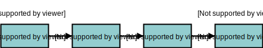
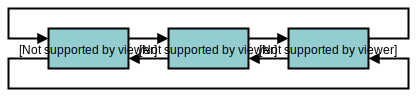

Linked lists are a data structure that every engineer should understand.

This post will teach you what linked lists are, why they're useful, and how they're implemented as a Java class, and in the Linux Kernel.

## What is a linked list?

A linked list is a collection of data connected via references.


Each element, or _node_, contains a value and a reference to next node in the list. The final node points to a null value.

In C, you can represent this as a `ListNode` `struct`, which contains `data`, and a `next` pointer to another `ListNode`:

```c++
struct ListNode {
  ListNode* next;
  DATA data;
}
```

Linked lists are conceptually similar to arrays, except there is no guarantee that linked list nodes exist in contiguous memory.

This means linked lists don't provide random access. To find an element in a linked list, you must traverse the list sequentially.

Commonly, you search a linked list by traversing the list and visiting each node. Starting at the first node in the list, known as the _head_, and finishing at the last node, known as the _tail_.



The following C function visits each node in a `while` loop, checking if the node contains the data it's searching for:

```c
struct ListNode* find(data) {
  struct ListNode* node = head;
  while(node) {
    if(node -> data == data) {
      return node;
    }
    node = node -> next;
  }
  return node;
}
```

Because each node must be traversed one after the other, an algorithm to access a value might need to traverse an entire list in the worst case. So linked list access is an O(n) operation.

Although access can take a long time, inserting a node in a linked list is constant time. For example, an `insert` method can add a new node to the end of a list by creating a node and changing the `tail -> next` pointer:

```c
ListNode* insert(data) {
  ListNode* node = create_node(data)
  tail -> next = node;
  tail = node;
}
```

A linked list where each node points to the next node in the list is known as a singly linked list.

To improve performance of some operations, like deletions, linked lists are often implemented with a reference to the previous node, as well as a reference to the next. This is known as a _doubly linked list_.


Most object oriented languages—like C++ and Java—include a linked list class in their standard library.

In Java, you can create a `LinkedList` object:

```java
LinkedList<String> list = new LinkedList<>();

list.add("a");
list.add("b");
list.add("c");
```

Linked link classes implement many methods. For example, methods for inserting nodes at a particular index in the list, removing nodes from the list, and searching for nodes by their value. I'll show you how the Java LinkedList class is implemented later in this post.

Now you know what a linked list is, the next question is why use them?

## Why do we use linked lists?

The two main benefits of link lists are:

* Constant time insertion and deletion
* Dynamic size

The main benefit is the speed of insertion and deletion. You can insert a node at a position in a linked list by changing the previous node and next node pointers. This is an O(1) operation.

The other benefit of linked lists is they grow dynamically. This is especially useful in language like C, where it can be costly to grow arrays. Because of this, linked lists are very popular in the Linux Kernel.

That said, there are some big downsides to linked lists. One big issue is that they have poor locality. In other words, the data could be stored in different regions of memory, which decreases performance, because computers are organized on the assumption of locality.

The other downside is the O(n) time to search for a list. This makes lists poor candidates inefficient for storing large lists that need to be traversed.

## How are linked lists implemented?

There are two main ways linked lists are implemented:

1. As a class
2. As a collection of functions

I'll show you two implementations: the `LinkedList` Java class, and linked lists in the Linux Kernel.

### Implementing linked lists as a class

Classes are a great way to implement data structures. You can encapsulate the details and expose public methods. Most object oriented languages implement

My favorite place to read the implementation of class-based data structures is in standard libraries. In this case, I'll show you how the Java `LinkedList` class is implemented.

_Note: You can see [the full class implementation on docjar](http://www.docjar.com/html/api/java/util/LinkedList.java.html)_


The Java LinkedList class is implemented as a doubly linked list, to make deletion easier.

I'll show how three methods are implemented: `getLast`, `removeLast`, and `add`. The full class implements many more methods, like `addFirst`, `contains`, `remove`, and `peek`.

_Note: if there's one thing you should take from this blog post series it's curiosity. There's a wealth of quality code that you can read as a reference for free_

You create a LinkedList in Java by providing the data type of the values that you will store in the list:

```java
LinkedList<String> scientists = new LinkedList<>();

letters.add("a");
letters.add("b");
letters.getLast(); // "b"
letters.removeLast();
letters.getLast(); // "a"
```

In the source code, the LinkedList class `extends` `AbstractSequentialList` and `implements` several others:


  ```java
public class LinkedList<E>
     extends AbstractSequentialList<E>
     implements List<E>, Deque<E>, Cloneable, java.io.Serializable
 {
   // ..
 }
```

The implementation I'll show you will exclude these from the code examples.

Before I show you how each method works, take a look at the `LinkedList` definition. Notice that the class contains a private `Node` class.

```java
public class LinkedList<E> {
     transient int size = 0;
     transient Node<E> first;
     transient Node<E> last;

     public LinkedList() {}

     public E getLast() {}

     public E removeLast() {}

     public boolean add(E e) {}

     private static class Node<E> {}
  }
```

The `Node` class represents nodes in the list. Each node contains a reference to the next node (`next`), and the previous node (`prev`). The node data is stored in `item`, which is of type `E` (a generic).

_Note: `E` is a generic type, which is used to provide a LinkedList that contain different data types_

```java
private static class Node<E> {
  E item;
  Node<E> next;
  Node<E> prev;

  Node(Node<E> prev, E element, Node<E> next) {
      this.item = element;
      this.next = next;
      this.prev = prev;
  }
}
```

`add` uses a `linkLast` method, which gets a reference to the tail node (`last`), and creates a new Node with the value (`e`) to be added. If there is no tail node (`last` is `null`), then the newNode is set as the head (`first`) and the tail `last`. If there is amn existing last node, then the existing last node `next` is set to point to the new node, and `last` is reassigned to the new node.

```java
public class LinkedList<E> {
  transient int size = 0;
  transient Node<E> first;
  transient Node<E> last;

  // ..

  void linkLast(E e) {
      final Node<E> l = last;
      final Node<E> newNode = new Node<>(l, e, null);
      last = newNode;
      if (l == null)
          first = newNode;
      else
          l.next = newNode;
      size++;
  }

  // ..
  public boolean add(E e) {
      // ..
    linkLast(e);
    return true;
  }
}
```

The other two methods are `getLast`. `getLast` is simple, it just returns the internal `last` variable:

```java
public class LinkedList<E> {
  // ..

  public E getLast() {
    final Node<E> l = last;
    if (l == null)
        throw new RuntimeException();
    return l.item;
  }

  // ..
}
```

`removeLast` is more interesting, it uses an internal function `unlinkLast` to remove the last node.

```java
public class LinkedList<E> {
  // ..
  public E removeLast() {
      final Node<E> l = last;
      if (l == null)
          throw new RuntimeException();
      return unlinkLast(l);
  }
  // ..
}
```

`unlinkLast` sets `last` to the `prev` node of the current last, and then sets the data of the node being removed to `null` (to help garbage collection).

```java
public class LinkedList<E> {
  // ..
  private E unlinkLast(Node<E> l) {
      final E element = l.item;
      final Node<E> prev = l.prev;
      l.item = null;
      l.prev = null; // help GC
      last = prev;
      if (prev == null)
          first = null;
      else
          prev.next = null;
      size--;
      return element;
  }
}
```

Putting this altogether, you get the following class:

```java
public class LinkedList<E> {
     transient int size = 0;
     transient Node<E> first;
     transient Node<E> last;

     public LinkedList() {}

     void linkLast(E e) {
         final Node<E> l = last;
         final Node<E> newNode = new Node<>(l, e, null);
         last = newNode;
         if (l == null)
             first = newNode;
         else
             l.next = newNode;
         size++;
     }

    private E unlinkLast(Node<E> l) {
         final E element = l.item;
         final Node<E> prev = l.prev;
         l.item = null;
         l.prev = null; // help GC
         last = prev;
         if (prev == null)
             first = null;
         else
             prev.next = null;
         size--;
         return element;
     }

     public E getLast() {
         final Node<E> l = last;
         if (l == null)
             throw new RuntimeException();
         return l.item;
     }

     public E removeLast() {
         final Node<E> l = last;
         if (l == null)
             throw new RuntimeException();
         return unlinkLast(l);
     }

     public boolean add(E e) {
         linkLast(e);
         return true;
     }

     // ..

     private static class Node<E> {
         E item;
         Node<E> next;
         Node<E> prev;

         Node(Node<E> prev, E element, Node<E> next) {
             this.item = element;
             this.next = next;
             this.prev = prev;
         }
     }
  }
```

As you can see, although there's a lot of lines, the source code is very readable. I recommend studying the full class definition if you want to learn more.

So that's an example of how linked lists are implemented in an object oriented (OO) language. But not all languages are OO, for example C. In C, linked lists are implemented using helper functions and `struct`.

### Implementing linked lists with functions

The linux kernel makes extensive use of linked lists, but they're implemented in an interesting way.

In C, a linked list node is represented in a struct, known as a _container_. An example is the `mjit_cont` struct in Ruby, that represents a linked list of execution contexts:

```c
struct mjit_cont {
    rb_execution_context_t *ec;
    struct mjit_cont *prev, *next;
};
```

Including the `prev` and `next` pointers in the `struct` that contains the list node data works fine, but .

The problem is that containers tie the implementation to the data structure. Any helper functions for accessing the list must be specific to the list type, in the case of Ruby there is a `mjit_cont_new` and `mjit_cont_free` function for adding/ removing contexts from the list.

The alternative is to use _intrusive linked lists_. An intrusive linked list works by providing pointers to other nodes:

```c
struct list_head {
	struct list_head *next, *prev;
};
```

Then, another struct would include a `list_head` type in its own field:

In linux kernel a linked list is defined as `list_head`:

```c

```

This is different from implementations that include data in the `struct`. For example, this struct from Ruby (known as a container) represents a doubly linked list of execution contexts:

```c
struct mjit_cont {
    rb_execution_context_t *ec;
    struct mjit_cont *prev, *next;
};
```

Containers that include data in the same structure as the pointer are known as _intrusive containers_.

Instead of including specific data in the definition, Linux keeps it generic. You use a `list_head` inside another `struct`:

```c
struct nmi_desc {
    spinlock_t lock;
    struct list_head head;
};
```

The `list_head` doesn't tie you to a specific data type. For example, you could include it in another struct that contains different data:

```c
struct mutex_waiter {
	struct list_head	list;
	struct task_struct	*task;
	struct ww_acquire_ctx	*ww_ctx;
};
```

Linux lists are circular linked lists:



Linux includes function for operating on a `list_head`, like an insert (`list_add`), delete (`list_del`), and access data (`list_entry`).

These functions are clever, they use the struct that the list is implemented in, so:

```c
#define list_entry(ptr, type, member) \
  container_of(ptr, type, member)
```

So then how do you access data, for example from `nmi_desc`?

Linux includes a helper function that returns a pointer to the data structure that contains the `list_entry`. So say we have a `nmi_desc`

const struct miscdevice *p = list_entry(v, struct miscdevice, list)


You don't really need to understand the code, but just think that this code
```c
#define container_of(ptr, type, member) ({   \
const typeof( ((type *)0)->member ) *__mptr = (ptr); \
(type *)( (char *)__mptr - offsetof(type,member) );})

#define list_entry(ptr, type, member) \
container_of(ptr, type, member)
```

Linux is also implemented as doubly linked list.

```
struct nmi_desc {
    spinlock_t lock;
    struct list_head head;
};
```

## Where are linked lists used?

* Memory allocation
* The Linux Kernel

Linked lists are used in memory allocation, like `malloc`, and garbage collected languages.

One example is Ruby, which.

Linked lists are also very popular in the Linux kernel. Queues, lists of ...
